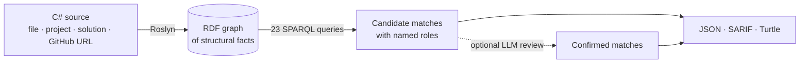

# Design Pattern Detection

Finds all 23 Gang of Four design patterns in C# source code, by turning the code into a knowledge
graph and asking it questions. It scores 0.83 F1 across seven real .NET libraries.

There are no regexes here, no naming conventions and no trained classifier. Every detector is a
SPARQL query over structural facts pulled out of the syntax tree, so a match arrives with its own
explanation. It names each role the pattern calls for and the type that fills it.

## See it

```console
$ dotnet run --project DesignPatternDetection

Scanned 23 file(s) with 23 detector(s).

Composite
    Match: component = Graphic, composite = CompoundGraphic, leaf = Dot

Decorator
    Match: component = DataSource, concreteComponent = FileDataSource, decorator = EncryptionDecorator

Observer
    Match: subject = NewsAgency, observer = Subscriber, concreteObserver = EmailSubscriber
    Match: subject = NewsAgency, observer = Subscriber, concreteObserver = SmsSubscriber

Timings: graph 1.19s, detectors 1.80s (total 2.99s). Slowest: Command 0.68s, Proxy 0.34s, Mediator 0.26s.
```

Those role names are the whole point. The tool never says that a file smells like a Composite. It
says which type plays which part.

## How it works



Roslyn reads the code and asserts facts into an RDF graph, things like `Dot extends Graphic` and
`CompoundGraphic hasField _children`. One SPARQL query per pattern then looks for the shape that
defines it. If you ask for it, a language model reads every candidate afterwards and drops the ones
that match structurally but miss the intent. Its verdicts are cached, so a second run costs nothing.

## A detector is just a query

Here is Composite, abridged. Watch the line about the collection.

```sparql
SELECT DISTINCT ?component ?composite ?leaf WHERE {
    ?component src:hasMethod ?operation .           # an abstraction with a shared operation
    ?operation src:hasModifier ?modifier .
    FILTER (?modifier IN (src:Abstract, src:Virtual))

    ?composite src:extends ?component .             # a subtype that overrides it and
    { ?composite src:hasField ?children } UNION { ?composite src:hasProperty ?children }
    ?children src:hasTypeArgument ?component .      # holds a COLLECTION of its own abstraction

    ?leaf src:extends ?component .                  # plus a sibling holding no such collection
    FILTER NOT EXISTS { ... }
}
```

A Decorator wraps its own abstraction too, but it holds a single reference rather than a whole
collection. That one distinction is what keeps the two detectors apart, and unlike a trained
classifier it is something you can read, argue with and edit yourself.

Coverage runs to 5 creational patterns, 7 structural ones and 11 behavioral ones.

## Try it on your own code

You need the [.NET 10 SDK](https://dotnet.microsoft.com/download).

```powershell
# a file, a directory, a .csproj, a .sln or a .slnx
dotnet run --project DesignPatternDetection -- path\to\App.slnx

# or a GitHub URL, which is cloned to a temp directory and deleted afterwards
dotnet run --project DesignPatternDetection -- https://github.com/owner/repo
```

Machine readable output comes with source spans.

```powershell
# --report writes JSON, --sarif writes SARIF 2.1.0 for GitHub code scanning,
# and --findings writes RDF Turtle aligned to the FDP pattern ontology
dotnet run --project DesignPatternDetection -- <input> --report out.json --sarif out.sarif --findings out.ttl
```

You can also have the matches reviewed for intent, or get at the raw graph.

```powershell
# every candidate goes to a language model, which drops what the query got wrong
dotnet run --project DesignPatternDetection -- <input> --verify           # ANTHROPIC_API_KEY
dotnet run --project DesignPatternDetection -- <input> --verify --verify-model gemini-3.7-flash  # GEMINI_API_KEY

# skip the detectors entirely and run your own SPARQL against the graph
dotnet run --project DesignPatternDetection -- <input> --query own.rq --turtle graph.ttl
```

## Does it actually work?

The detectors were scored against ground truth labeled by hand, over 40 units drawn from seven real
.NET libraries. Those are MediatR, NLog, Serilog, YamlDotNet, log4net, Castle.Core and NUnit.

|                       | precision | recall | F1 |
| --------------------- | --------: | -----: | -----: |
| structural only       | 0.544 | 0.860 | 0.667 |
| with LLM review       | 0.818 | 0.837 | 0.828 |
| change                | +0.274 | −0.023 | +0.161 |
| 95 % CI *(jackknife)* | [+0.193, +0.355] | [−0.069, +0.023] | [+0.120, +0.202] |

These figures are averaged over units, so a pattern counts once for every unit it appears in. Macro
F1, which weights each pattern equally however rare it happens to be, moves from 0.429 to 0.695.

The raw counts tell it more plainly. Review threw out 23 of the 31 false positives, leaving 8, and
it cost exactly one true positive along the way.

SPARQL on its own therefore finds nearly everything but flags far too much, and a language model
reading intent cleans that up almost for free. Adjudicating all 454 candidates took 1.76 million
input tokens, 41 thousand output tokens and 159 seconds.

You can reproduce every number above. Each corpus is cloned when it is needed and deleted straight
afterwards.

```powershell
$eval = "DesignPatternDetection.Evaluation"

# structural only
dotnet run --project $eval -- --corpora --report structural.json

# with review, scored against the structural run (needs GEMINI_API_KEY)
dotnet run --project $eval -- --corpora --verify --verify-model gemini-3.7-flash --baseline structural.json --report reviewed.json

# the table above
dotnet run --project $eval -- --analyze reviewed.json
```

## Reproducing the results in a container

The evaluation also runs in Docker for maximum reproducibility. See [DOCKER.md](DOCKER.md) for the
instructions.
